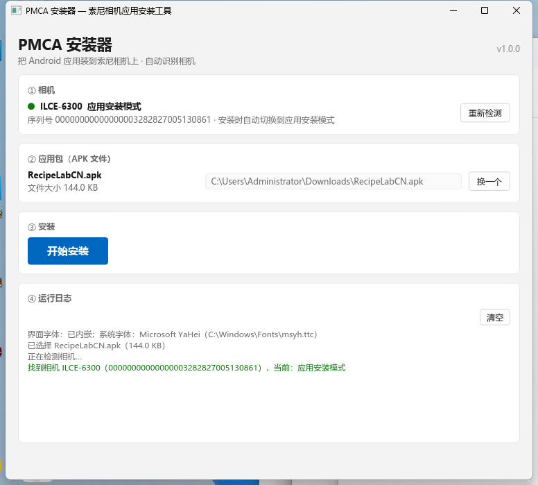

# PMCA 安装器

**在 Windows 上给索尼相机安装 Android 应用的小工具。**

插上相机 → 选一个 APK → 点一下，就装好了。

> 索尼官方的 PlayMemories Camera Apps 商店已经关闭了，这个工具用本机模拟官方商店的方式，
> 把任意 APK 装进相机。

- 全中文界面，Windows 11 风格
- 单文件 exe，**双击即用**，不需要装 Python、驱动或任何运行库
- 相机模式**全自动切换**，不用去相机菜单里翻设置
- 4.5 MB，启动快，不需要显卡



---

## 支持的相机

需要相机**支持 PlayMemories Camera Apps**（即相机里原本有"应用商店/PlayMemories"菜单）。
例如：

- ILCE 系列（α5000 / α5100 / α6000 / **α6300** / α6500 …）
- NEX 系列、DSC 部分机型、部分 Handycam

程序**不靠型号清单判断**，而是现场问相机"你支持这几个操作码吗"——
这比硬编码名单可靠（同一型号在不同固件下能力也可能不同）。

如果你的相机不支持，程序会直接告诉你，不会让你瞎试。

---

## 使用方法

1. 下载 `PMCA-Installer.exe`
2. 相机用 USB 线连到电脑，开机
3. 双击运行，点「选择文件…」选一个 APK
4. 点「开始安装」

也可以：
- 把 APK **拖进窗口**，或拖到程序图标上
- 命令行：`PMCA-Installer.exe 某个应用.apk`

安装过程有进度条和日志，成功/失败都会明确告诉你。

---

## 装不上怎么办

### 「请把相机改成 MTP 模式」

相机的 USB 连接方式设成了「海量存储器」。

**改法**：相机菜单 → 设置 → USB → USB 连接 → 选「MTP」
然后拔插一次 USB 线。

（「电脑遥控」模式下也一样，同样改成 MTP。）

### 「相机拒绝了开始任务」

相机里残留着上一次**没走完**的任务。

**解决**：把相机 USB 线**拔下再插上**，然后重新安装。

> 这不是 bug。相机一旦有过未完成的任务就会拒绝新的，而这个状态程序清不掉
> （试过替它收尾，相机不认）。

### 找不到相机

按顺序检查：

1. 相机已开机、USB 线插好（要能传数据的线，不是只充电的）
2. 相机菜单里的 USB 连接方式不是「海量存储器」
3. 关掉可能占用相机的程序（Windows 照片应用、资源管理器的相机预览、原版 PMCA）

### 装到一半失败

先拔插一次 USB 线再重试。程序每次运行都会写一份 `install-diag.log`，
里面有完整的过程记录，报问题时请一并附上。

---

## 关于 APK 的选择

相机的 Android 版本比较老（例如 α6300 是 Android 2.3.7）。
**要求较新 Android 的应用装不上** —— 这种失败由相机自己判定并回报。

建议选那些明确兼容老 Android 的应用，或者专门为相机做的应用
（比如 OpenMemories 系列）。

---

## 从源码构建

需要 Rust（1.88 或更新）和 MSVC 生成工具。

```bash
git clone https://github.com/XiaoQAQ10086/PMCA-Installer.git
cd sony-app-installer

# 开发时运行（会保留控制台窗口，方便看日志）
cargo run -p sony-gui

# 出发布版
cargo build --release -p sony-gui
# 产物：target/release/PMCA-Installer.exe

# 跑测试
cargo test
```

### 项目结构

```
crates/
  sony-core/     协议栈：索尼代理消息、手写 TLS 1.0、SPK 打包、XPD 清单、HTTP、假商店
  sony-usb/      Windows WPD 传输层（C 薄封装调 COM）+ SetupAPI 设备枚举
  sony-install/  安装编排：命令行和图形界面**共用这一份逻辑**
  sony-gui/      图形界面（iced）
  app/           命令行诊断工具
```

---

## 版本号

版本号只在**一处**定义：根 `Cargo.toml` 的 `version`。
界面右上角、`--version`、发行包都用它，不会对不上。

---

## 许可证与致谢

本项目采用 MIT 许可证，见 [LICENSE](LICENSE)。

它的可行性完全建立在 [ma1co/Sony-PMCA-RE](https://github.com/ma1co/Sony-PMCA-RE) 之上 ——
是那个项目搞清楚了索尼相机安装应用的整套流程。详见
[THIRD-PARTY-NOTICES.md](THIRD-PARTY-NOTICES.md)。
